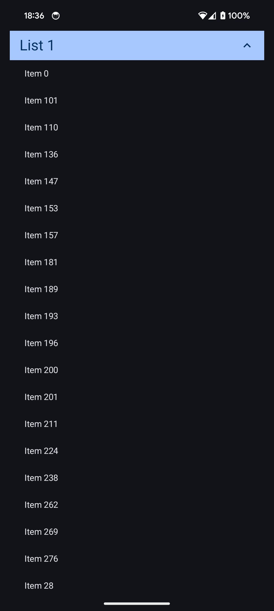
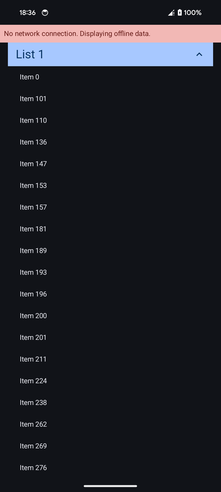

# Architecture

The app is modular by design. It's overkill for the complexity of the requirements, but represents how I would build 
the app if it were to be expanded upon.

## app

The main `app` module contains the UI elements, theme setup, dependency injection via Hilt, the home screen, its 
ViewModel, and a network status tracker.

## data

The `data` module contains the code that fetches the items. There's a repository class, some Room database setup, 
and a couple of data transfer objects for isolating remote/db changes from the local app's representation of an item.

## models

The `models` module contains only the local representation of an item.

# User Interface Choices

I decided to display the items in a LazyColumn because it's simple to implement in Compose. I added sticky headers 
because I thought it made the list a lot more readable. I added collapse/expand functionality to the headers so you 
can quickly collapse the items you don't want to see, saving a lot of scrolling.

I added UI states to represent the following:

1. Data is loading
2. Data has loaded
3. An error was encountered when retrieving data
4. The network is not available and no data has been cached
5. The network is not available, but cached data is present

Some screenshots are available in the `screenshots` directory.

# Testing

I wrote some unit tests for the ViewModel using JUnit5 and MockK. I manually tested that the app is readable in both 
dark and light mode. I also manually tested the app in different network conditions, with and without cached data.

# Library Choices

I've made some choices about libraries that are mostly based on my own experience. Some are potentially unexpected, 
so I want to take a little time to explain them. Typically I'm comfortable with their alternatives, too, but have a 
preference.

## Ktor

I used Ktor for the network request. I previously used Retrofit/OkHTTP exclusively, but I find that Ktor is a good 
replacement. I've used it for API requests and WebSocket connections in Android and desktop applications.

## Hilt

I've used Koin for simple non-Android projects, and I like it a lot, but I don't think anything can beat Hilt for DI on 
Android at the moment.

# Screenshots

  
  
  

